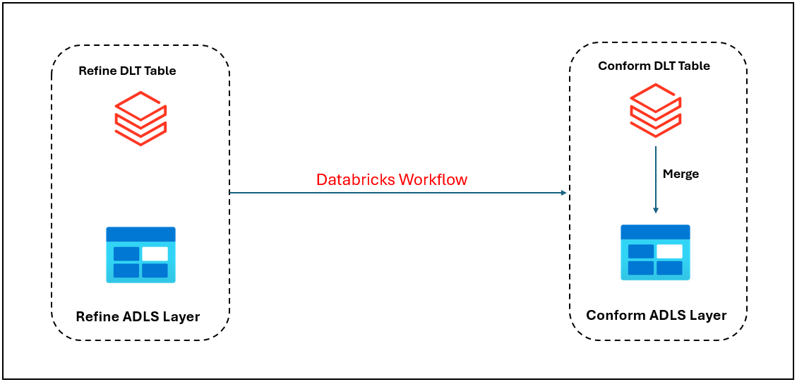

# **GMDF -Conform zone creation Asset   DESIGN SPECIFICATIONS**

|**REVIEWERS**  |
| :- |

The following individuals have reviewed this document for their area of expertise. 

- **DIA SME –** Sarah O'Dea
- **DIA Solution Architect –** Saunak Debroy
- **DIA Validation Lead –** Priya MC

|**AGREEMENTS** |
| :- |
The following individuals have agreed with the contents of this document. 

-  **System Custodian –** Joaquin Rincon
-  **System Owner –** Bryant E Thompson
-  **Computer System Quality Assurance (CSQA) –** Brian Minick

 

**PURPOSE**

This Design Specification serves as a comprehensive resource for support teams tasked with developing and maintaining the GMDF-Conform zone creation Asset. Continuously updated, it presents vital design information crucial for system upkeep, ensuring relevance across the system's lifecycle.

 

**IN SCOPE**

The following are in scope:

- GMDF -Conform zone creation Asset Utilities component design
- Code versioning and Deployment pipelines

**OUT OF SCOPE**

Anything not specifically mentioned in the "in scope" section of this document.

 

**ACRONYMS AND DEFINITIONS**

The following acronyms are used:

|**Acronym**|**Description**|
| :-------- | :------------ |
|**GMDF**|Global Manufacturing Data Fabric|

 

**TABLE OF CONTENTS**

[1. OVERVIEW](#1-overview)

[2. DESIGN SPECIFICATION	](#2-design-specification)

[2.1 Azure Databricks Workflow Design   ](#21-azure-databricks-workflow-design)

[3. Transformation Azure tables strategy    ](#3-ingestion-azure-ingestion-strategy)

[3.1  Launching the workflow for transformation  ](#31-launching-the-workflow-for-ingestion)

[3.2 Databricks Workflow ](#32-databricks-workflow)

[4. Vacuum Strategy](#4-vacuum-strategy)

[5. Table Creation Strategy](#5-table-creation-strategy)

[6. Azure Databricks Unity Catalog Log Tables](#6-azure-databricks-unity-catalog-log-tables)

[DOCUMENT REVISION HISTORY	](#document-revision-history)

# **1. OVERVIEW**
The GMDF -Conform zone creation Asset component is a dedicated custom component whose design is described in this document. 

The tranformation and loading component implements separate functionalities that serve as auxiliary methods for the GMDF-DP architecture. In particular, it has the following purposes:
1. The main objective of this program is to create a Conform zone to host data as a single source of truth for the asset data product.
2. Implements log retention on Azure Blob Storage
3. This document is intended to capture the asset data product technical details to create the Databricks pipelines and ingest data in delta format.

The service used to develop the new component is Azure Databricks Workflow. It consists of a workflow that launches all components functionalities in series. Jobs and functions read the necessary information about tables, constraints and configurations from configuration tables and log tables stored in Azure Databricks Unity Catalog. 

The component functionalities are designed to be launched sequentially in the same workflow execution. 

 

# **2. DESIGN SPECIFICATION**
The following table lists all resources in scope of the GMDF -Conform zone creation Asset component:

|**Resource Name**|**Azure Service**|**GitHub repository**|
| :- | :- | :- |
|**asset_data_product_scd.ipynb**|Databricks Notebook|mq-dia-gmdf-dp/Asset_Data_Product/Notebooks|
|**con_execution_log.ipynb**|Databricks Notebook|mq-dia-gmdf-dp/Asset_Data_Product/Execution_Logs|
|**table_creation_parameterized.ipynb**|Databricks Notebook|mq-dia-gmdf-dp/Asset_Data_Product/Configurations|
|**vacuum_delta_tables.ipynb**|Databricks Notebook|mq-dia-gmdf-dp/Asset_Data_Product/Vacuum_Delta_Table|

## **2.1 Azure Databricks Workflow Design**
There is an GMDF -Conform zone creation Asset component for each system and site to be integrated in GMDF-DP Conform layer. The naming convention of the Azure Databricks Workflow component has been defined in such a way that it is clear which system is transformed. The transformation and loading from Azure refine to conform is managed by an Azure Databricks Workflow named as follow:

>gmdfdp_conform_asset_dataproduct

The scheduling is managed through Azure Databricks Workflow set up properties.

The Azure Databricks Workflow is designed to run the following procedures sequentially: 
-  log-execution-start task will capture the details to the global execution table.
-  scd_logic_run task to perform merge operation between previous Azure conform tables and last delta files read from Azure refine tables.
-  log-execution-end task will capture the details of the runs to the global and execution log tables.

 

The following is a list of high-level steps that each component performs launching the respective notebook: 
1. ***log-execution-start*** : This task writes logs for the component in Azure conform layer. At the beginning, it creates an entry in the `global_execution` table, displaying the 'RUNNING' status.
2. ***scd_logic_run*** : This task will perform SCD TYPE-I merge operations in order to incrementally load data to the CONFORM layer. It also logs in the `con_execution` table.
3. ***log-execution-end*** : At the end, it insert a row in the `global_execution` table displaying information on statistics, start and end time, status code and table processed for the current run.

 

**Figure 1****

 

# **3. Transformation Strategy**
The purpose of this component is to build Databricks pipelines to ingest IT Asset data from ADLS Gen2 REFINE zone into Databricks' Conform zone. 

The GMDF -Conform zone creation Asset architecture includes Azure DevOps pipelines and Azure Databricks Workflows. The Azure DevOps Pipelines manage changes on Azure Databricks Workflows for the transformation in Conform layer. 

The following table summarizes the Azure services in scope of the transformation procedure: 

|**Resource Name**|**Azure Service**|
| :- | :- |
|**gmdfdp_conform_asset_dataproduct**|DevOps Pipeline|
|**gmdfdp_conform_asset_dataproduct**|Databricks Workflow|

 

The Azure Databricks Workflows are built through a yml file stored in *deployment_asset_dataproduct* GitHub repository. When one of these yml files is modified, an Azure DevOps Pipeline is triggered and performs the updates on the respective Databricks Workflow.

The Figure below briefly summarizes how the Azure GMDF -Conform zone creation Asset component is interfaced with DevOps automatic pipelines:

**Figure 2****

## **3.1 Launching the workflow for transfomation and ingesting data into conform layer**
The transformation component can be launched in two different ways:
-	*batch*: for runs triggered by a scheduled rule
-	*manual*: for manual runs to be performed on demand

The Azure refine to conform transformation and loading component can be invoked with different loading options, which are explained below:

- ***Full** –* This mode is invoked during the first load of a new Source system integrated in the GMDF -Conform zone creation Asset, or when for any reason it is necessary to perform a full load of the entire table(s).
- ***Delta** -* This mode is the standard one for all the Source systems that completed the first full ingestion. It performs the incremental loading of all transactions received in the Azure refine area since the last version of the conform table was created in Azure. 

 

The following JSON is an example of the JSON input to invoke the Azure transformation component using SCD for all the loading mode mentioned above:

***Json configuration example***

~~~json
scd json:
{
  "tables": 
  [
   {
        "source_schema": "refine",
        "source_table": "source_table",
        "target_schema": "conform",
        "target_table": "target_table",
        "primary_key":["primary_target"],
		    "source_primary_key":["source_primary_key"],
        "r_rcrd_sts_cd":"r_rcrd_sts_cd",
        "r_del_tmstmp": "r_del_tmstmp",
        "r_upd_tmstmp": "r_upd_tmstmp",
        "r_ins_tmstmp": "r_ins_tmstmp",
        "column_schema": [
        {
          "source_column": "source_column",
          "target_column": "target_column",
          "target_data_type": "target_data_type"
        }
        ]
     }
  ]
}

~~~
In the above json format we have declared for all tables the source schema and target schema which will be used to dynamically run in the SCD logic and delta records will be loaded.

In addition to this, the GMDF -Conform zone creation Asset component needs the following input parameters:  

|**Parameter**|**Definition**|
| :-- | :-- |
|**global_log_table**|name of the global_execution log table|
|**database**|specifies the layer to which the data is being tranformed to|
|**catalog**|the Azure Databricks Unity Catalog name where conform layer tables are stored|
|**systems**|this is a json which comprises of launch, r_src_id and mode of execution|
|**storage_account**|the name of the storage account used for specific environment|
|**container**|External location in the azure ADLS for storing the tables and config files|
|**run_id**|job run id number given for individua runs in the workflow|
|**etl_job**|job name given for the workflow|
|**mode**|loading option for the transformation process|

## **3.2 Transformation and loading to Azure conform layer in Databricks Workflow**
GMDF -Conform zone creation Asset component is composed of log-execution-start, scd_logic_run and log-execution-end in which the input parameters are read and workflow is executed. 

The steps of gmdfdp_conform_asset_dataproduct in the Azure Databricks Workflow: 

-  log-execution-start task writes logs for the component in Azure conform layer. It creates an entry in the `global_execution` table, displaying the 'RUNNING' status.
-  Reading of input paramters and running for “full” or in “delta” mode for each table. 
-  scd_logic_run task starts next by reading all table level information for the json present in the ADLS location and scd type 1 is performed for all tables.
-  log-execution-end task will run next and all information regarding the logs will be copied to the con_execution and global_execution table.
-  If the any task contains an error, it will send an email notification with job run failure details.

•	SCD-1 will be applied during data ingestion from refine to Conform.
•	Delete Logic: When the 'r_rcrd_sts_cd' column is marked as "D" (indicating deletion) and the 'r_del_tmstmp' column is NOT NULL (indicating a valid deletion timestamp).
•	Insert Logic: The 'r_ins_tmstmp' column is used for tracking the timestamp when a record was initially inserted into the database.
•	Update Logic: The 'r_upd_tmstmp' column It typically represents the timestamp when a record was last updated, which can be useful for tracking changes to records in the table.
•	Delta Logic: In Conform layer all table should be having ’lst_modified_tmstmp‘ as timestamp to identify delta changes.

 

The process required to ingest data from Azure refine to conform is illustrated in the Figure below:

**Figure 3****

 

# **4. Vacuum Strategy**
The aim of the Vacuum component is to remove all data files that are no longer in the latest state of the transaction log for the table and are older than a retention threshold, which by default is set as **7 days**. Indeed, these files are no longer necessary to represent the current state of the table, and they can be safely removed.
 

The following table lists all resources in scope of the Azure refine to conform transformation and loading component:

|**Resource Name**|**Azure Service**|**GitHub repository**|
| :- | :- | :- |
|**vacuum_delta_tables.ipynb**|Databricks Notebook|mq-dia-gmdf-dp/Asset_Data_Product/Vacuum_Delta_Table|

There is a Databricks Workflow for each system; it is named ***gmdfdp_Vacuum_Execution_Asset***.

Below, there is an example of the JSON input to invoke the Vacuum component:

***Json configuration example***

~~~json
{
  "tables": 
  [
   {
        "target_schema": "conform",
        "target_table": "target_table names"

   }
  ]
}
~~~

 

# **5. Table Creation Strategy**
The scope of the component is to create tables on Azure Databricks Unity Catalog in Conform schema. 

The following table lists all resources in scope of the GMDF -Conform zone creation Asset component for table creation:

|**Resource Name**|**Azure Service**|**GitHub repository**|
| :- | :- | :- |
|**table_creation_parameterized.ipynb**|Databricks Notebook|mq-dia-gmdf-dp/Asset_Data_Product/Configurations|

In ADLS location there is a JSON file that contains informations on source system folder, name and DDL, of the tables in scope of the GMDF -Conform zone creation Asset.  
Table creation ***gmdfdp_asset_data_ddl*** workflow in Azure Databricks will dynamically create inscope tables in unity catalog delta location and external location in the ADLS. 

The Azure Databricks Workflow will catch the differences between the JSON file on ADLS location and Azure tables, and it can perform the following operations:
- Create an Azure Delta table on Unity Catalog
- Drop an Azure Delta table on Unity Catalog and all its metadata
- Add a column 
- Drop a column 
- Change a column datatype
- Change the primary key constraint.

The Azure Databricks Workflow can be also launched manually giving as input the list of the systems.

The Figure below briefly summarizes how the table creation component is interfaced with DevOps automatic pipelines:

**Figure 4****

 

# **6. Azure Databricks Unity Catalog Log Tables**
In addition we have implemented the log execution for the tranformation and loading the data in to the conform layer which gives a detailed explanation of the tables loaded and status of those tables.

|**Table name**|**Database name**|**Schema name**|**Description**|
| :- | :- | :- | :- |
|**con_execution**|mq_gmdf_dev|conform|Contains execution information about all GMDF -Conform zone creation Asset workflow. It reports one row for each table ingested in the execution.|
|**global_execution**|mq_gmdf_dev|conform|Contains global execution information for each GMDF -Conform zone creation Asset layer. It reports one single row for each execution.|

 

## **DOCUMENT REVISION HISTORY**

|**Version** |**Revision Date**|**Summary of Changes**|**Revised By, Role**|**Reference Number**|
| :-- | :-- | :-- | :-- | :-- |
|1.0|18-Mar-2024|New document|""Gajendra Singh, Developer|CHG CHG2291904|
